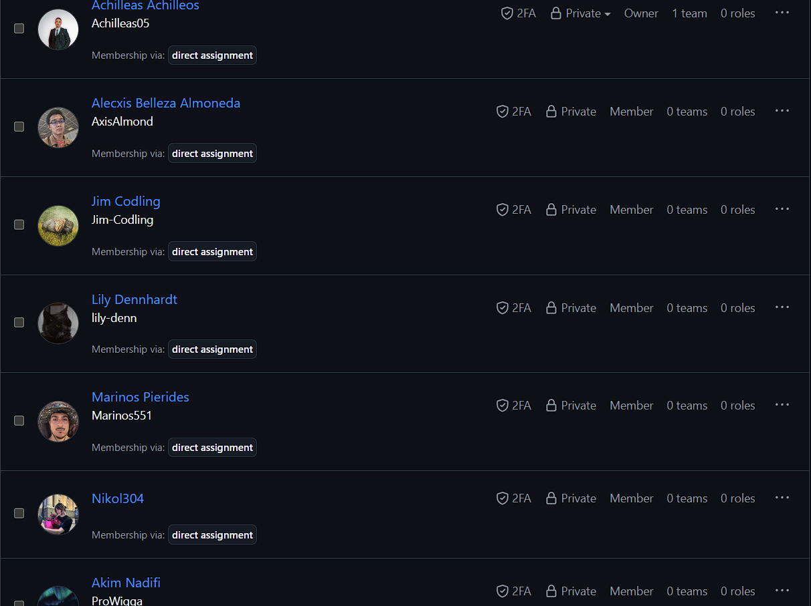
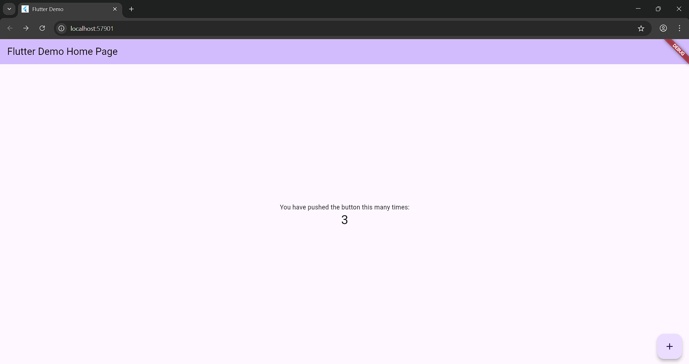
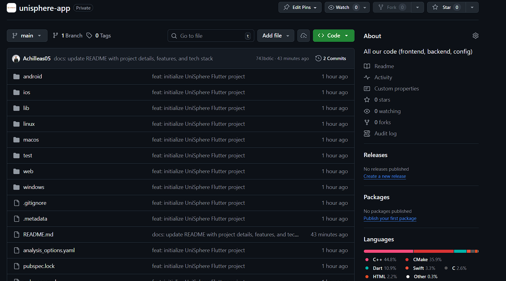

# UniSphere – Event Discovery & Management Platform


**UniSphere** is a cross-platform event discovery and management application designed for university students and young adults. It connects event attendees with organizers through a centralized, social, and transparent platform.

**Coursework Project:** Software Engineering Theory and Practice (M30819) – University of Portsmouth

---

## 📋 Table of Contents

- [📸 Implementation Evidence](#-implementation-evidence)
- [✨ Key Features](#-key-features)
  - [🎯 For Attendees](#-for-attendees)
  - [🛠️ For Organizers](#️-for-organizers)
- [🛠️ Tech Stack](#️-tech-stack)
  - [Technology Decision Rationale](#technology-decision-rationale)
- [📁 Project Structure](#-project-structure)
- [⚙️ Installation](#️-installation)
  - [Prerequisites](#prerequisites)
  - [Setup Steps](#setup-steps)
- [🚀 Usage](#-usage)
  - [Development Commands](#development-commands)
  - [Key Development Workflows](#key-development-workflows)
- [👥 Team & Contributions](#-team--contributions)
  - [Contribution Guidelines](#contribution-guidelines)
- [🗺️ Development Roadmap](#️-development-roadmap)
- [📄 License](#-license)
- [📞 Contact](#-contact)

---

## 📸 Implementation Evidence

### **GitHub Organization Setup**


_Figure 1: UniSpheree GitHub organization showing all 7 team members as contributors_

### **Flutter Application Running**


_Figure 2: UniSphere Flutter application successfully running on Android emulator_

### **Repository Structure**


_Figure 3: Well-organized repository structure with initial commits_

**These screenshots provide evidence for Chapter 3: Implementation:**

- ✅ **Version Control Setup**: GitHub organization with all team members
- ✅ **Tools Investigation**: Flutter development environment established
- ✅ **Project Initialization**: Repository structure and initial commits

---

## ✨ Key Features

### 🎯 For Attendees

- **Centralized Discovery**: Browse events from multiple sources in one place
- **Smart Filtering**: Filter by location, price, category, and distance
- **Social Integration**: See which friends are attending and share events
- **Transparent Pricing**: All fees displayed upfront with no hidden charges
- **Calendar Sync**: One-click addition to Google/Apple/Outlook calendars
- **Personalized Recommendations**: AI-powered suggestions based on interests

### 🛠️ For Organizers

- **Easy Event Creation**: Simple form for creating both small and large events
- **Analytics Dashboard**: Track ticket sales, views, demographics, and engagement
- **Communication Tools**: Send updates and reminders to attendees
- **Payment Integration**: Sell tickets with clear fee breakdowns
- **Capacity Management**: Set guest limits and track RSVPs

---

## 🛠️ Tech Stack

| Layer                | Technology                           | Purpose                                                                    |
| -------------------- | ------------------------------------ | -------------------------------------------------------------------------- |
| **Frontend**         | Flutter (Dart)                       | Cross-platform mobile app (iOS & Android)                                  |
| **Backend**          | Firebase / PostgreSQL                | Flexible backend: Firebase for prototyping, PostgreSQL for complex queries |
| **Database**         | Firestore (NoSQL) / PostgreSQL (SQL) | Real-time vs relational data modeling                                      |
| **Authentication**   | Firebase Auth / Custom OAuth         | Quick integration vs custom security workflows                             |
| **Maps & Location**  | Google Maps API                      | Event location visualization and geofencing                                |
| **State Management** | Provider/Riverpod                    | Efficient state propagation in Flutter                                     |
| **Version Control**  | Git & GitHub                         | Collaborative development and versioning                                   |
| **CI/CD**            | GitHub Actions                       | Automated testing, building, and deployment                                |

## Technology Decision Rationale

### **Frontend: Flutter**

We selected **Flutter** for its:

- **Cross-platform capabilities**: Single codebase for iOS and Android
- **Rapid development**: Hot reload for fast iteration
- **Expressive UI**: Rich widget library and customizability
- **Team familiarity**: Existing expertise accelerates development

### **Backend: undecided (Firebase or PostgreSQL)**

We have not made a final decision on the backend yet — the team is actively evaluating two viable options: **Firebase** (serverless, managed) and **PostgreSQL** (relational, self-hosted or managed). Below is a neutral summary to support the decision process.

### **Firebase (managed / serverless)**

- Pros: Fast to set up, built-in Auth, Firestore/Realtime for low-latency updates, managed scaling and services (Cloud Functions, FCM)
- Best for: Rapid prototyping, realtime social/notification features, minimal server maintenance
- Trade-offs: Vendor lock-in, different cost model, less control over complex relational queries

### **PostgreSQL (relational / SQL)**

- Pros: Strong transactional guarantees, flexible relational modeling, powerful querying and reporting (SQL), easy migration between hosts
- Best for: Complex analytics, financial/payment flows, strict data integrity and reporting requirements
- Trade-offs: Requires more backend setup and operational management (or use a managed provider)

### **Decision criteria**

- Choose Firebase if the priority is speed of development, realtime features and minimal ops effort.
- Choose PostgreSQL if the priority is complex queries, transactional guarantees, or long-term control of data and schemas.
- Consider a hybrid approach or migration path if requirements evolve (e.g., start with Firebase for prototyping, add or migrate to PostgreSQL later for reporting/transactions).

Direct alignment with requirements (guidance)

- NFR3 (Performance): Both platforms can meet performance targets when provisioned properly; Firebase gives realtime advantages out of the box, while PostgreSQL performance depends on schema/indexing and hosting.
- NFR4 (Security): Both support strong security models; Firebase Auth provides easy integration, while PostgreSQL-based solutions will require implementing authentication/authorization (e.g., OAuth/JWT) and secure hosting.
- NFR7 (Scalability): Firebase handles horizontal scaling automatically; PostgreSQL scales well with appropriate architecture (read replicas, partitioning) or managed services.
- FR3 (Notifications): Firebase Cloud Messaging is a ready-made option; notifications can also be implemented with custom services when using PostgreSQL.

#### **Other Technologies**

- **Google Maps API**: Directly supports UR-A3 (event mapping requirement)
- **Provider/Riverpod**: Flutter-recommended for state management
- **GitHub Actions**: Enables CI/CD as evidence for implementation chapter

---

## 📁 Project Structure

```
unisphere-app/
├── android/ # Android-specific configuration
├── ios/ # iOS-specific configuration
├── lib/ # Main Dart/Flutter source code
│ └── main.dart # Application entry point
├── linux/ # Linux desktop support
├── macos/ # macOS desktop support
├── test/ # Unit and widget tests
├── web/ # Web platform support
├── windows/ # Windows desktop support
├── .dart_tool/ # Dart build system cache
├── .idea/ # IDE configuration
├── .gitignore # Git ignore rules
├── .metadata # Flutter IDE metadata
├── analysis_options.yaml # Dart static analysis configuration
├── pubspec.lock # Locked dependency versions
├── pubspec.yaml # Project dependencies and metadata
└── README.md # This documentation file
```

---

## ⚙️ Installation

### Prerequisites

- **Flutter SDK** (v3.0.0+): [Installation Guide](https://flutter.dev/docs/get-started/install)
- **Firebase Account**: [Create Project](https://console.firebase.google.com/)
- **Git**: [Download Git](https://git-scm.com/downloads)

### Setup Steps

1. **Clone the repository**

   ```bash
   git clone https://github.com/UniSpheree/unisphere-app.git
   cd unisphere-app
   ```

2. **Install dependencies**

   ```bash
   flutter pub get
   ```

3. **Configure Firebase**

   - Create a new project in [Firebase Console](https://console.firebase.google.com/)
   - Add iOS and Android apps to your project
   - Download `google-services.json` (Android) and `GoogleService-Info.plist` (iOS)
   - Place them in `android/app/` and `ios/Runner/` respectively

4. **Run the application**

   ```bash
   # For iOS
   flutter run -d ios

   # For Android
   flutter run -d android
   ```

---

## 🚀 Usage

### Development Commands

```bash
# Run the app in debug mode
flutter run

# Run tests
flutter test

# Build for production
flutter build apk --release      # Android APK
flutter build appbundle --release # Android App Bundle
flutter build ios --release      # iOS
flutter build web --release      # Web

# Analyze code for issues
flutter analyze

# Format code
dart format lib/
```

### Key Development Workflows

1. **Feature Development**: Create feature branch: `git checkout -b feat/feature-name`
2. **Testing**: Write tests in `test/` directory before implementation
3. **Code Review**: Submit pull requests with clear descriptions and testing evidence
4. **Integration**: Merge to `main` after approval and CI/CD validation
5. **Documentation**: Update README.md and inline code comments

---

## 👥 Team & Contributions

### Team Structure

| Name          | Student ID | Role                                | Key Contributions                                                                |
| ------------- | ---------- | ----------------------------------- | -------------------------------------------------------------------------------- |
| **Achilleas** | 2258434    | **Project Coordinator & Tech Lead** | Requirements oversight, use case diagrams, GitHub setup, implementation strategy |
| **Marinos**   | 2266126    | **Design Co-Lead**                  | Use case diagrams, system requirements collaboration                             |
| **Lily**      | 2279849    | **Requirements Analyst**            | User requirements documentation (UR-A1 to UR-B13)                                |
| **Alecxis**   | 2278372    | **Systems Analyst**                 | System requirements specification (FR1-FR15, NFR1-NFR8)                          |
| **Akim**      | 2306587    | **System Modeller**                 | System models & technical diagrams                                               |
| **Jim**       | 2281534    | **Architecture Designer**           | Architectural design & component diagrams                                        |
| **Nikol**     | 2265796    | **Documentation Lead**              | Final report compilation & editing                                               |

### Project Coordination

**Achilleas** coordinates deliverables, sets internal deadlines, and ensures alignment between requirements, design, and implementation phases. Regular team syncs track progress against the coursework timeline.

### Contribution Guidelines

1. **Branch Naming Convention**:

   - `feat/`: New features (e.g., `feat/event-discovery`)
   - `fix/`: Bug fixes (e.g., `fix/login-error`)
   - `docs/`: Documentation (e.g., `docs/update-readme`)
   - `refactor/`: Code refactoring
   - `test/`: Test additions

2. **Commit Messages**: Follow [Conventional Commits](https://www.conventionalcommits.org/)

   - Format: `type: description`
   - Example: `feat: add filtering by category and distance`

3. **Code Standards**:

   - Follow Dart/Flutter style guide
   - Run `dart format` before committing
   - Add comments for complex logic
   - Write unit tests for new functionality

4. **Review Process**:

   - All PRs require at least one team review
   - Reviewers check: functionality, code quality, testing, documentation
   - No direct pushes to `main` branch

5. **Testing Requirements**:
   - Unit tests for business logic
   - Widget tests for UI components
   - Integration tests for user flows
   - Minimum 80% test coverage for new features

---

## 🗺️ Development Roadmap

### 🎯 Coursework 1 (Dec 2025)

- ✅ **Project Setup**: GitHub organization, repository structure
- ✅ **Requirements**: User & system requirements documented
- ✅ **Design**: Use case diagrams completed
- 🔄 **Architecture**: System modelling in progress
- 🔄 **Implementation**: Flutter project initialized
- 📋 **Testing**: Test plans for NFRs under development
- 📋 **Report**: Final compilation pending

### 🚀 Coursework 2 (Jan–May 2026)

- **Phase 1**: Core features (event browsing, user authentication)
- **Phase 2**: Social features (friends, sharing, notifications)
- **Phase 3**: Organizer tools (event creation, analytics, payments)
- **Phase 4**: Optimization, testing, deployment

### 📊 Requirements Traceability

Our development directly addresses all documented requirements:

- **FR1-FR15**: Implemented through Flutter components and Firebase services
- **NFR1-NFR8**: Addressed via technology choices and testing strategies
- **UR-A1-UR-B13**: Validated through user testing and iterative development

### ⚠️ Known Limitations

- **iOS Deployment**: Requires Apple Developer account ($99/year)
- **Firebase Limits**: Free tier constraints on database operations
- **Offline Support**: Basic caching implemented; full offline sync in roadmap
- **Payment Processing**: Initial integration with Stripe; additional providers planned

---

## 📄 License

### Academic Use

This project is developed for educational purposes as part of the **Software Engineering Theory and Practice (M30819)** module at the University of Portsmouth.

### Academic Integrity

All team members certify that:

1. This work is original and created by the team
2. All third-party code/resources are properly cited using APA 7 format
3. We adhere to the University's Student Conduct Policy
4. We have watched the University's Plagiarism video tutorial

### Copyright

**Copyright © 2025 UniSphere Development Team**. All rights reserved for original code and documentation. Third-party libraries and frameworks are used under their respective licenses.

### References

All references follow APA 7 format and are included in the final coursework report.

---

## 📞 Contact

### Academic Contacts

- **Module Coordinator**: Dr Claudia Iacob – claudia.iacob@port.ac.uk
- **Academic Tutor**: Eleni Noussi – eleni.noussi@port.ac.uk
- **Student Engagement Officer**: Ana Baker – ana.baker@port.ac.uk

### Project Resources

- **GitHub Organization**: [github.com/UniSpheree](https://github.com/UniSpheree)
- **Main Repository**: [github.com/UniSpheree/unisphere-app](https://github.com/UniSpheree/unisphere-app)
- **Module**: M30819 Software Engineering Theory and Practice
- **Institution**: University of Portsmouth

### Support Services

- **ASDAC**: Additional support for students with disabilities
- **Well-being Service**: Mental health and well-being support
- **Extenuating Circumstances**: For serious issues affecting submission

---

_Last Updated: December 2025_
_Version: 1.0.0 (Coursework 1 Release)_
